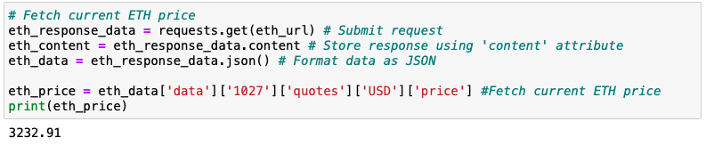
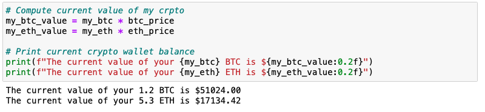

# APIs - Financial Planning

## Background

I decided to start a FinTech consultancy firm, and I want to make a difference by working on projects with high social impact in local communities. I just won my first contract to help one of the biggest credit unions in my area. They want to create a tool that helps their members enhance their financial health. The Chief Technology Officer (CTO) of the credit union asked me to develop a prototype application to demo in the next credit union assembly.

The credit union board wants to allow the union's members to assess their monthly personal finances, and also be able to forecast a reasonably good retirement plan based on cryptocurrencies, stocks, and bonds.

In this project, I will focusing on using APIs as part of the technical solution - to create two financial analysis tools.

The first will be a personal finance planner that will allow users to visualize their savings composed by investments in shares and cryptocurrencies to assess if they have enough money as an emergency fund.

The second tool will be a retirement planning tool that will use the Alpaca API to fetch historical closing prices for a retirement portfolio composed of stocks and bonds, then run Monte Carlo simulations to project the portfolio performance at 30 years. You will then use the Monte Carlo data to calculate the expected portfolio returns given a specific initial investment amount.

---

### Files

* [Personal Finance Planner starter code](Project_Code/financial-planner.ipynb)

* [MCForecastTools toolkit](Project_Code/MCForecastTools.py)

---

### Resources

This project will utilize two APIs:

* The **Alpaca Markets API** will be used to pull historical stocks and bonds information.

* The **Alternative Free Crypto API** will be used to retrieve Bitcoin and Ethereum prices.

The documentation for these APIs can be found via the following links:

* [Free Crypto API Documentation](https://alternative.me/crypto/api/)

* [AlpacaDOCS](https://alpaca.markets/docs/)
---

### Part 1 - Personal Finance Planner

In this section of the project, I will create a personal finance planner application. To develop the personal finance planner prototype, take into account the following assumptions:

* The average household income for each member of the credit union is $12,000.

* Every union member has a savings portfolio composed of cryptocurrencies, stocks and bonds:

    * Assume the following amount of crypto assets: `1.2` BTC and `5.3` ETH.

    * Assume the following amount of shares in stocks and bonds: `50` SPY (stocks) and `200` AGG (bonds).

Use the starter Jupyter notebook to complete the following steps.

#### Collect Crypto Prices Using the `requests` Library

1. Create two variables called `my_btc` and `my_eth`. Set them equal to `1.2` and `5.3`, respectively.

2. Use the `requests` library to fetch the current price in US dollars (`USD`) of bitcoin (`BTC`) and ethereum (`ETH`) using the **Alternative Free Crypto API**.

3. Parse the API JSON response to select only the crypto prices and store each price in a variable.

4. Compute the portfolio value of cryptocurrencies and print the results.

#### Collect Investments Data Using Alpaca: `SPY` (stocks) and `AGG` (bonds)

**Important:** I created a `.env` file in my working directory to store the values of your Alpaca API key and Alpaca secret key.

1. Create two variables named `my_agg` and `my_spy` and set them equal to `200` and `50`, respectively.

2. Set the Alpaca API key and secret key variables, then create the Alpaca API object using the `tradeapi.REST` function from the Alpaca SDK.

3. Format the current date as ISO format. Y\\\

4. Get the current closing prices for `SPY` and `AGG` using Alpaca's `get_bars()` function. Transform the function's response to a Pandas DataFrame and preview the data.

5. Pick the `SPY` and `AGG` close prices from the Alpaca's `get_bars()` DataFrame response and store them as Python variables. Print the closing values for validation.

6. Compute the value in dollars of the current amount of shares and print the results.

#### Savings Health Analysis

In this section, you will assess the financial health of the credit union's members.

1. Create a variable called `monthly_income` and set its value to `12000`.

2. To analyze savings health, create a DataFrame called `df_savings` with two rows. Store the total value in dollars of the crypto assets in the first row and the total value of the shares in the second row.

3. Use the `df_savings` DataFrame to plot a pie chart to visualize the composition of personal savings.

4. Use `if` conditional statements to validate if the current savings are enough for an emergency fund. An ideal emergency fund should be equal to three times your monthly income.

    * If total savings are greater than the emergency fund, display a message congratulating the person for having enough money in this fund.

    * If total savings are equal to the emergency fund, display a message congratulating the person on reaching this financial goal.

    * If total savings are less than the emergency fund, display a message showing how many dollars away the person is from reaching the goal.

### Part 2 - Retirement Planning

In this section, I will use the Alpaca API to fetch historical closing prices for a retirement portfolio and then Use the MCForecastTools toolkit to create Monte Carlo simulations to project the portfolio performance at `30` years. Then use the Monte Carlo data to answer questions about the portfolio.

#### Monte Carlo Simulation

1. Use the Alpaca API to fetch five years historical closing prices for a traditional `40/60` portfolio using the `SPY` and `AGG` tickers to represent the `60%` stocks (`SPY`) and `40%` bonds (`AGG`) composition of the portfolio. Make sure to convert the API output to a DataFrame and preview the output.

    > *Note*: In Monte-Carlo Simulation, getting data as far back as possible matters, because if we simulate using only small amounts of data during a recent time when markets are booming, or instead falling precipitously, a Monte-Carlo Analysis will inadvertently extrapolate this temporary market movement too far into the future. Getting data over a longer time period mitigates this effect.

2. Configure and execute a Monte Carlo Simulation of `500` runs and `30` years for the `40/60` portfolio.

3. Plot the simulation results and the probability distribution/confidence intervals.

    

    

#### Retirement Analysis

1. Fetch the summary statistics from the Monte Carlo simulation results.

1. Given an initial investment of `$20,000`, calculate the expected portfolio return in dollars at the `95%` lower and upper confidence intervals.

2. Calculate the expected portfolio return at the `95%` lower and upper confidence intervals based on a `50%` increase in the initial investment.

 

---

### Considerations

* Added the `.env` files to the `.gitignore` configuration to avoid exposing my API keys in my GitHub repository.

* A `.gitignore` file contains file names and extensions of files that you don't want pushed to your repository. For more information on how a `gitignore` works, you can read the documentation [here](https://docs.github.com/en/github/using-git/ignoring-files).

